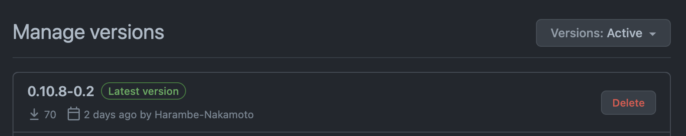

# ApeSwap UIkit


ApeSwap UIkit is a set of React components and hooks used to build pages on ApeSwap's apps. It also contains a theme file for dark and light mode.

## Install
Create a [Github Personal Access](https://docs.github.com/en/authentication/keeping-your-account-and-data-secure/creating-a-personal-access-token) token.  

Export the personal access token as NPM_TOKEN  
`export NPM_TOKEN=<your-token>`  

`yarn add @apeswapfinance/uikit`  

## Publishing
The approach to publishing for this repo is very important because the [apeswap-frontend](https://github.com/ApeSwapFinance/apeswap-frontend) will pull the `latest` version of the package regardless of release version. (Prerelease or otherwise)

New features added to this `ui-kit` will likely need to be tested in a separate environment which means we can't publish test packages with the `latest` tag until we are ready to use them in production. 

Looking at the [ui-kit versions](https://github.com/ApeSwapFinance/apeswap-uikit/packages/609809/versions) page, you will see which package will be install by default with the `latest` tag. (This applies the same for the NPM package directory)
  

### Publish Flow
1. Make updates to the UI kit
2. Update the version and add a alpha/beta id (`npm version prepatch --preid alpha`)
3. Publish the version with an alpha/beta tag (`yarn publish --tag=alpha0`)
4. Install the proper package for testing (`npm install @apeswapfinance/uikit@0.10.9-alpha.0`)
5. Make changes and update the prerelease version (`npm version prerelease --preid alpha`) 
6. Publish the new prerelease version (`yarn publish --tag=alpha1`)
7. After making the final updates, version the package with the prerelease id removed (`npm version 0.10.9`)
8. Publish the final version with a `latest` tag (`npm publish`)
9. With the `latest` publish above, the version will be installed by default when running `npm install @apeswapfinance/uikit`

### Example: 
Current version is `0.10.8`  

#### Alpha versions
`npm version prepatch --preid alpha`  
Version is changed to `0.10.9-alpha.0` (_**WARNING**: If you publish this version with the default `npm publish` it will be set as the `latest` release and be installed by default on the frontend. Follow below for more details_)  

Publish the **prerelease** with the proper tag based on your prerelease version. **This will ensure the package is not installed by default on the frontend.** 
`yarn publish --tag=alpha0`  

After making updates to the first alpha version, another alpha version can be published:  
`npm version prerelease --preid alpha`
Version is changed to `0.10.9-alpha.1`  
`yarn publish --tag=alpha1`  

#### Beta versions (if needed)
If a beta version is needed it can also be created:  
`npm version prerelease --preid beta`  
Version is changed to `0.10.9-beta0`  
`yarn publish --tag=beta0`  

#### Publish Final Version
To remove the prerelease version run the following with the proper version number:  
`npm version 0.10.9`  

Publish the version
`npm publish`

### Installing Prerelease Versions
To print out the available versions for installing run:  
`npm dist-tag ls @apeswapfinance/uikit`  

To install a prerelease from above:  
`npm install @apeswapfinance/uikit@0.10.9-alpha.1`

To install the final version just run the standard install command:  
`yarn add @apeswapfinance/uikit`  


## Setup

### Theme

Before using ApeSwap UIkit, you need to provide the theme file to styled-component.

```
import { ThemeProvider } from 'styled-components'
import { light, dark } from '@apeswapfinance/uikit'
...
<ThemeProvider theme={isDark}>...</ThemeProvider>
```

### Reset

A reset CSS is available as a global styled component.

```
import { ResetCSS } from '@apeswapfinance/uikit'
...
<ResetCSS />
```

### Types

This project is built with Typescript and export all the relevant types.
